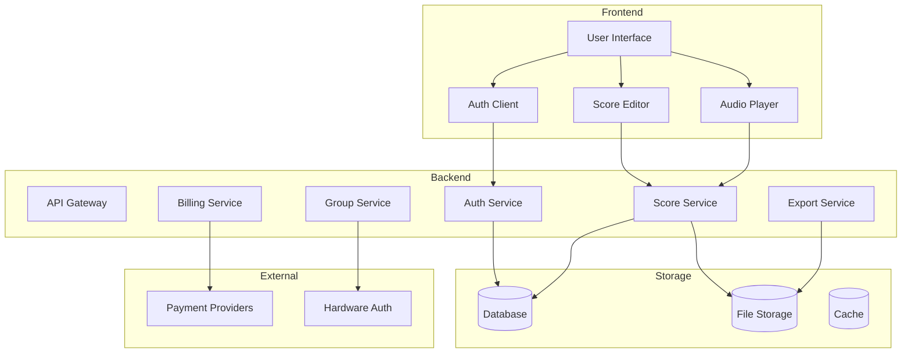
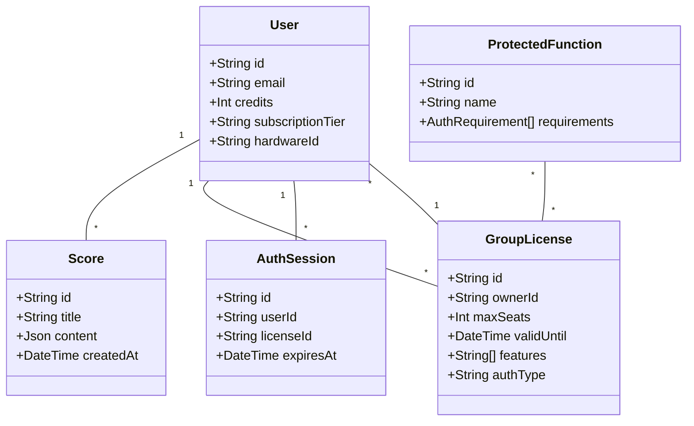

# Maistro Roadmap

## Current Phase (In Development)

### Core Music Notation Features
- [x] Basic score editing and display
- [x] Real-time collaboration support
- [x] Score annotations
- [ ] Advanced music analysis tools
- [ ] Audio playback integration

### Billing and Licensing
- [x] Pay-per-export model
- [x] Credit packages
- [x] Optional subscriptions
- [x] Anti-screenshot measures
- [ ] Group licensing system
  - [x] Basic framework
  - [ ] Function-level authorization
  - [ ] Teacher presence detection
  - [ ] Remote authorization fallback

### Export Features
- [x] Basic PDF export
- [ ] MIDI export
- [ ] MusicXML export
- [ ] Audio export (MP3/WAV)

## Next Phase

### Enhanced Group Features
- [ ] Teacher dashboard
- [ ] Student progress tracking
- [ ] Assignment management
- [ ] Collaborative exercises
- [ ] Real-time group sessions

### Advanced Analysis
- [ ] Harmonic analysis
- [ ] Performance metrics
- [ ] Style recognition
- [ ] Difficulty assessment

### Mobile Support
- [ ] Progressive Web App
- [ ] Mobile-optimized UI
- [ ] Offline capabilities
- [ ] Touch-optimized notation

## Future Vision

### AI Integration
- [x] YOLOv11 integration for sheet music detection
  - [x] Model training pipeline
  - [x] GPU-optimized inference
  - [ ] Real-time detection API
- [ ] Automated accompaniment
- [ ] Style-based suggestions
- [ ] Performance feedback
- [ ] Composition assistance

### Extended Platform
- [ ] Marketplace for scores
- [ ] Teacher-student matching
- [ ] Virtual recitals
- [ ] Integration with physical instruments

### Community Features
- [ ] Social sharing
- [ ] Collaborative composition
- [ ] Public score library
- [ ] Community challenges

## System Architecture



## Domain Model



## Authorization Ontology

```mermaid
graph LR
    subgraph Functions
        Export[Export Score]
        Edit[Edit Score]
        Share[Share Score]
        Analyze[Analyze Score]
    end

    subgraph Requirements
        Teacher[Teacher Presence]
        Remote[Remote Auth]
        Credits[Credit Balance]
        Subscription[Subscription]
    end

    subgraph Methods
        BLE[BLE Proximity]
        Database[Database Check]
        Hardware[Hardware Present]
    end

    Export --> Credits
    Export --> Teacher
    Edit --> Teacher
    Share --> Remote
    Analyze --> Subscription

    Teacher --> BLE
    Teacher --> Hardware
    Remote --> Database
