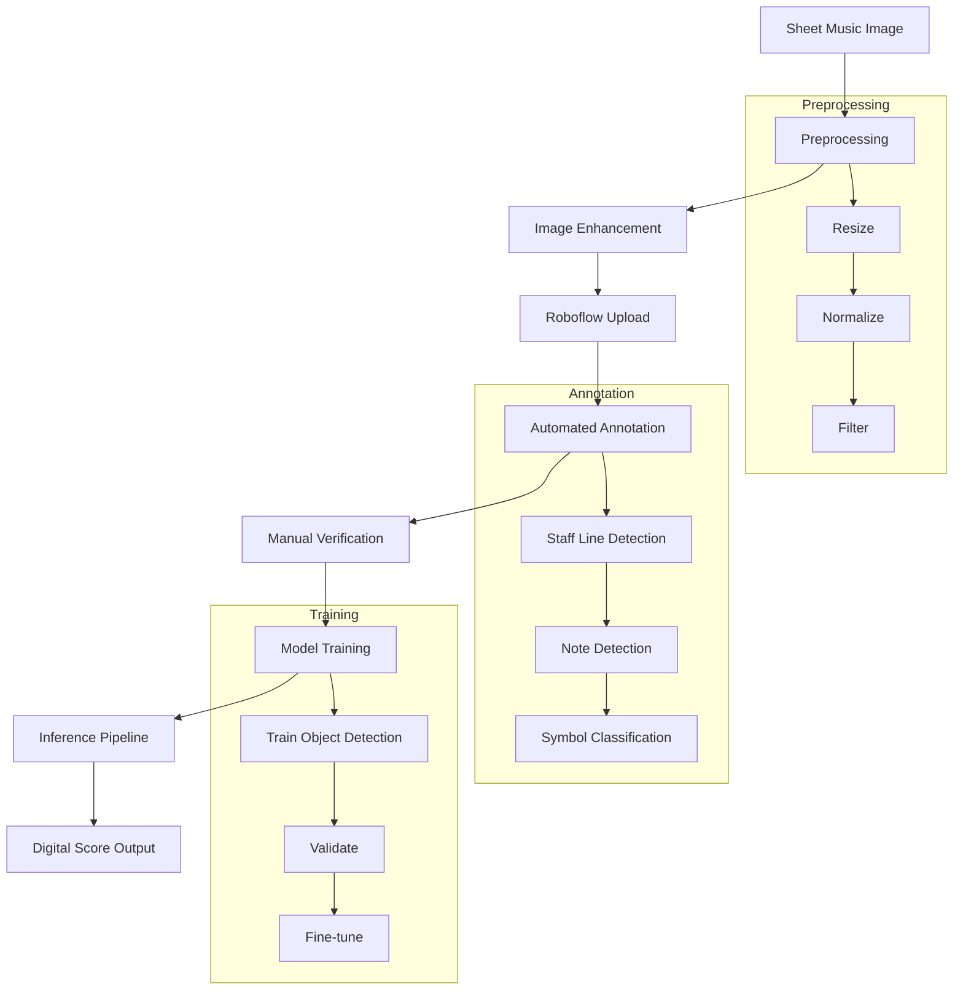
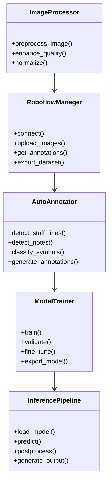
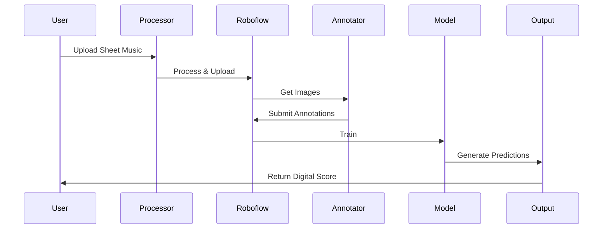

# Maistro System Architecture

## System Flow

```mermaid
graph TD
    A[Sheet Music Image] --> B[Preprocessing]
    B --> C[Image Enhancement]
    C --> D[Roboflow Upload]
    D --> E[Automated Annotation]
    E --> F[Manual Verification]
    F --> G[Model Training]
    G --> H[Inference Pipeline]
    H --> I[Digital Score Output]

    subgraph Preprocessing
        B --> B1[Resize]
        B1 --> B2[Normalize]
        B2 --> B3[Filter]
    end

    subgraph Annotation
        E --> E1[Staff Line Detection]
        E1 --> E2[Note Detection]
        E2 --> E3[Symbol Classification]
    end

    subgraph Training
        G --> G1[Train Object Detection]
        G1 --> G2[Validate]
        G2 --> G3[Fine-tune]
    end
```

## Component Architecture

```mermaid
classDiagram
    class ImageProcessor {
        +preprocess_image()
        +enhance_quality()
        +normalize()
    }

    class RoboflowManager {
        +connect()
        +upload_images()
        +get_annotations()
        +export_dataset()
    }

    class AutoAnnotator {
        +detect_staff_lines()
        +detect_notes()
        +classify_symbols()
        +generate_annotations()
    }

    class ModelTrainer {
        +train()
        +validate()
        +fine_tune()
        +export_model()
    }

    class InferencePipeline {
        +load_model()
        +predict()
        +postprocess()
        +generate_output()
    }

    ImageProcessor --> RoboflowManager
    RoboflowManager --> AutoAnnotator
    AutoAnnotator --> ModelTrainer
    ModelTrainer --> InferencePipeline
```

## Data Flow

```mermaid
sequenceDiagram
    participant User
    participant Processor
    participant Roboflow
    participant Annotator
    participant Model
    participant Output

    User->>Processor: Upload Sheet Music
    Processor->>Roboflow: Process & Upload
    Roboflow->>Annotator: Get Images
    Annotator->>Roboflow: Submit Annotations
    Roboflow->>Model: Train
    Model->>Output: Generate Predictions
    Output->>User: Return Digital Score
```
