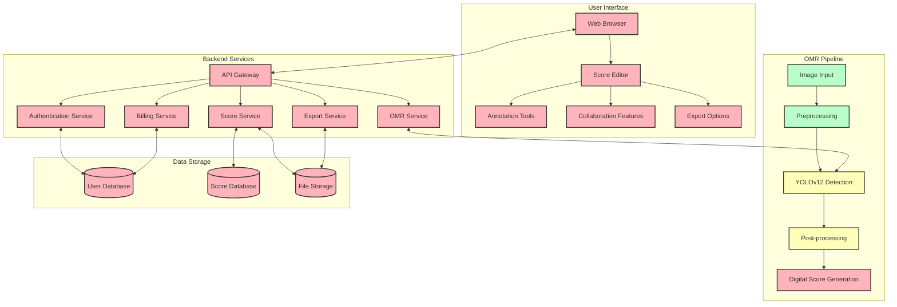

```mermaid
graph TD
    subgraph User Interface
        A[Web Browser] --> B[Score Editor]
        B --> C[Annotation Tools]
        B --> D[Collaboration Features]
        B --> E[Export Options]
    end

    subgraph Backend Services
        F[API Gateway] --> G[Authentication Service]
        F --> H[Score Service]
        F --> I[OMR Service]
        F --> J[Export Service]
        F --> K[Billing Service]
    end

    subgraph OMR Pipeline
        L[Image Input] --> M[Preprocessing]
        M --> N[YOLOv12 Detection]
        N --> O[Post-processing]
        O --> P[Digital Score Generation]
    end

    subgraph Data Storage
        Q[(User Database)]
        R[(Score Database)]
        S[(File Storage)]
    end

    A <--> F
    G <--> Q
    H <--> R
    H <--> S
    I <--> N
    J <--> S
    K <--> Q

    classDef complete fill:#baffc9,stroke:#333,stroke-width:2px;
    classDef inProgress fill:#ffffba,stroke:#333,stroke-width:2px;
    classDef notStarted fill:#ffb3ba,stroke:#333,stroke-width:2px;
    
    class L,M complete;
    class N,O inProgress;
    class A,B,C,D,E,F,G,H,I,J,K,P,Q,R,S notStarted;
```
