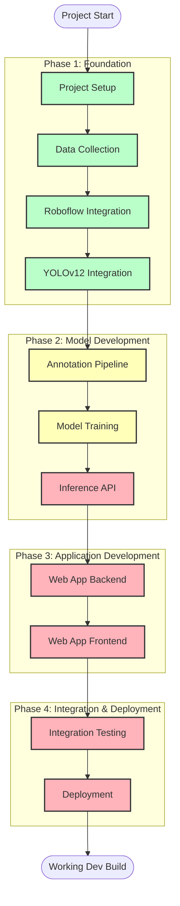

```mermaid
graph TD
    Start([Project Start]) --> A[Project Setup]
    A --> B[Data Collection]
    B --> C[Roboflow Integration]
    C --> D[YOLOv12 Integration]
    D --> E[Annotation Pipeline]
    E --> F[Model Training]
    F --> G[Inference API]
    G --> H[Web App Backend]
    H --> I[Web App Frontend]
    I --> J[Integration Testing]
    J --> K[Deployment]
    K --> End([Working Dev Build])

    subgraph "Phase 1: Foundation"
        A
        B
        C
        D
    end

    subgraph "Phase 2: Model Development"
        E
        F
        G
    end

    subgraph "Phase 3: Application Development"
        H
        I
    end

    subgraph "Phase 4: Integration & Deployment"
        J
        K
    end

    classDef complete fill:#baffc9,stroke:#333,stroke-width:2px;
    classDef inProgress fill:#ffffba,stroke:#333,stroke-width:2px;
    classDef notStarted fill:#ffb3ba,stroke:#333,stroke-width:2px;
    
    class A,B,C,D complete;
    class E,F inProgress;
    class G,H,I,J,K notStarted;
```
