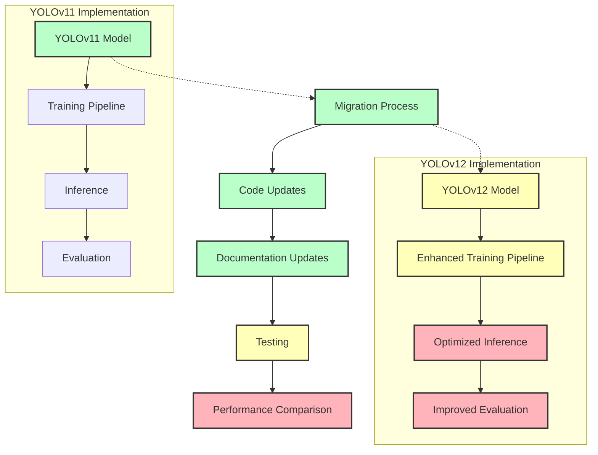

```mermaid
flowchart TD
    subgraph "YOLOv11 Implementation"
        A1[YOLOv11 Model] --> B1[Training Pipeline]
        B1 --> C1[Inference]
        C1 --> D1[Evaluation]
    end

    subgraph "YOLOv12 Implementation"
        A2[YOLOv12 Model] --> B2[Enhanced Training Pipeline]
        B2 --> C2[Optimized Inference]
        C2 --> D2[Improved Evaluation]
    end

    E[Migration Process] --> F[Code Updates]
    F --> G[Documentation Updates]
    G --> H[Testing]
    H --> I[Performance Comparison]

    A1 -.-> E
    E -.-> A2

    classDef complete fill:#baffc9,stroke:#333,stroke-width:2px;
    classDef inProgress fill:#ffffba,stroke:#333,stroke-width:2px;
    classDef notStarted fill:#ffb3ba,stroke:#333,stroke-width:2px;
    
    class A1,E,F,G complete;
    class H,A2,B2 inProgress;
    class C2,D2,I notStarted;
```
