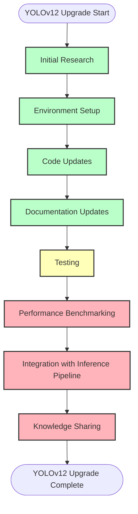

```mermaid
graph TD
    Start([YOLOv12 Upgrade Start]) --> A[Initial Research]
    A --> B[Environment Setup]
    B --> C[Code Updates]
    C --> D[Documentation Updates]
    D --> E[Testing]
    E --> F[Performance Benchmarking]
    F --> G[Integration with Inference Pipeline]
    G --> H[Knowledge Sharing]
    H --> End([YOLOv12 Upgrade Complete])

    classDef complete fill:#baffc9,stroke:#333,stroke-width:2px;
    classDef inProgress fill:#ffffba,stroke:#333,stroke-width:2px;
    classDef notStarted fill:#ffb3ba,stroke:#333,stroke-width:2px;
    
    class A,B,C,D complete;
    class E inProgress;
    class F,G,H notStarted;
```
