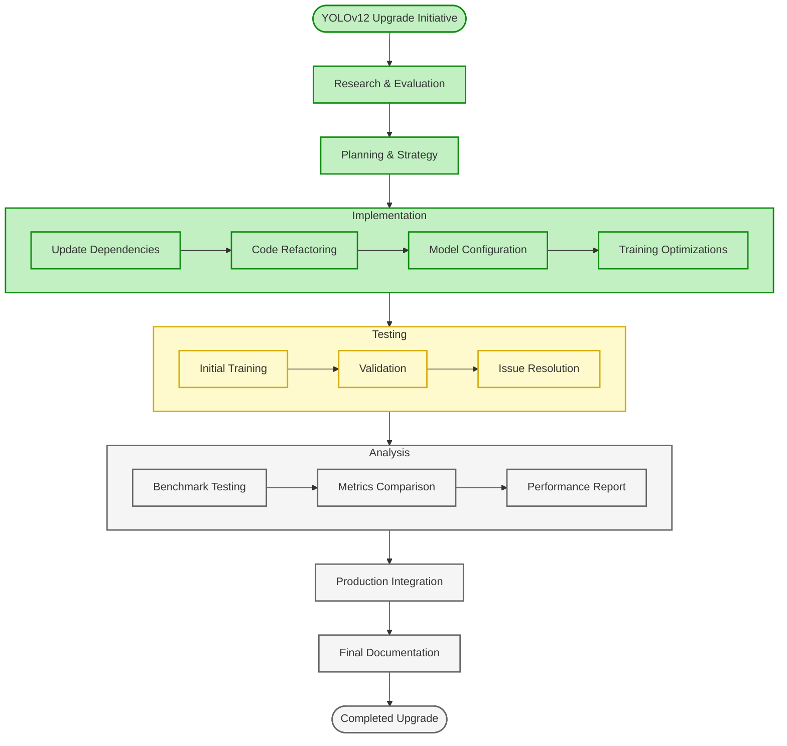

```mermaid
flowchart TD
    %% Main workflow
    Start([YOLOv12 Upgrade Initiative]) --> Research[Research & Evaluation]
    Research --> Planning[Planning & Strategy]
    Planning --> Implementation[Implementation]
    Implementation --> Testing[Testing & Validation]
    Testing --> Analysis[Performance Analysis]
    Analysis --> Integration[Production Integration]
    Integration --> Documentation[Final Documentation]
    Documentation --> End([Completed Upgrade])
    
    %% Detailed implementation steps
    subgraph Implementation
        I1[Update Dependencies] --> I2[Code Refactoring]
        I2 --> I3[Model Configuration]
        I3 --> I4[Training Optimizations]
    end
    
    %% Testing process
    subgraph Testing
        T1[Initial Training] --> T2[Validation]
        T2 --> T3[Issue Resolution]
    end
    
    %% Analysis process
    subgraph Analysis
        A1[Benchmark Testing] --> A2[Metrics Comparison]
        A2 --> A3[Performance Report]
    end
    
    %% Status indicators
    classDef completed fill:#c2f0c2,stroke:#0d8b0d,stroke-width:2px;
    classDef inProgress fill:#fffacd,stroke:#d4ac0d,stroke-width:2px;
    classDef pending fill:#f5f5f5,stroke:#666666,stroke-width:2px;
    
    %% Apply status classes
    class Start,Research,Planning,Implementation,I1,I2,I3,I4 completed;
    class Testing,T1,T2,T3 inProgress;
    class Analysis,Integration,Documentation,End,A1,A2,A3 pending;
```
